<h3><code>syed@github ~ $ ./contributions.sh</code></h3>

  

<h3><code>syed@github ~ $ whoami</code></h3>

<table>
<tr>
<td valign="top">
  
</td>
<td valign="top">
  
</td>
</tr>
</table>

---

## 🛠️ Tech Stack

### Data Science & Machine Learning

**Python • Scikit-learn • TensorFlow • PyTorch • Predictive Modelling • Classification • Feature Engineering • Statistical Analysis • NLP • BERT • Anomaly Detection • MCMC • Reinforcement Learning • Ensemble Learning**

### Data Analytics & Business Intelligence

**SQL • BigQuery • Power BI • Looker Studio • Google Analytics 4 • Tableau • ETL • Data Visualization • Dashboard Development • Reporting • Matplotlib • Seaborn**

### Programming & Data Technologies

**Python • R • SQL • MongoDB • Google Apps Script • APIs • Git • Bash • HTML/CSS • Jupyter • Visual Studio • Figma**

---

## 🚀 Featured Projects

### 🧠 BERT-Based Intent Classification
Fine-tuned **BERT** for sequence-based intent classification and improved **F1 score by 12%** over the baseline.

`NLP` `BERT` `Python` `Deep Learning`

### 🎮 Hybrid Machine Learning Game Agent
Developed an ensemble machine-learning agent with engineered features, achieving **82.5% validation accuracy**, **0.798 validation F1**, and **28.18/32 evaluation performance**.

`Machine Learning` `Ensemble Learning` `Feature Engineering` `Python`

### 🤖 Reinforcement Learning Game Agent
Implemented **Q-Learning** with a compact state representation and dynamic parameter decay to improve agent performance.

`Reinforcement Learning` `Q-Learning` `Python`

### 📉 Customer Churn Prediction
Engineered features across a **50,000+ row dataset** and achieved **78% accuracy** using Logistic Regression and SVM classifiers.

`Classification` `Scikit-learn` `Feature Engineering` `Python`

### 🌍 World Values Survey — Behavioural Analytics
Cleaned and analyzed a **50,000-row survey dataset** using missing-value handling, visualization, regression and clustering for country-level comparison.

`Analytics` `Regression` `Clustering` `Data Visualization`

### ⚖️ Responsible Generative AI — Diffusion Bias Analysis
Analyzed bias in diffusion-based image editing with **InstructPix2Pix**, performed fairness analysis and designed a debiasing framework.

`Generative AI` `Responsible AI` `Diffusion Models` `Fairness`

---

## 💼 Experience

### Data Science Intern — Kasatria Technologies Sdn Bhd
**Dec 2025 – Mar 2026 | Kuala Lumpur, Malaysia**

- Automated Google-service data pulls and a **GA4 custom-dimension workflow** using Google Apps Script and APIs
- Worked across **GA4, BigQuery and Looker Studio** to validate reporting metrics and build analytical dashboards
- Benchmarked anomaly-detection approaches using **TimesFM, ARIMA Plus and z-score baselines**
- Applied **MCMC** and **Marketing Mix Modeling** to multi-channel attribution and marketing effectiveness

### Manager — Papersdock
**Jan 2023 – Nov 2025 | Remote**

- Managed end-to-end student onboarding, billing and financial administration for **1,500+ students**
- Performed monthly financial reconciliations across high-volume student and payment records
- Coordinated team schedules and operational workflows

---

## 🏅 Certifications & Professional Development

### 🤖 Machine Learning & AI

- **Machine Learning** — DeepLearning.AI
- **Supervised Machine Learning: Regression and Classification** — DeepLearning.AI
- **Advanced Learning Algorithms** — DeepLearning.AI
- **Unsupervised Learning, Recommenders, Reinforcement Learning** — DeepLearning.AI
- **Developing AI Applications with Python and Flask** — IBM
- **Introduction to Artificial Intelligence (AI)** — IBM

### ☁️ Google Cloud, Data & Analytics

- **Introduction to AI and ML** — Google Cloud Skills Boost
- **Big Data and Machine Learning Fundamentals** — Google
- **Introduction to AI and Machine Learning on Google Cloud** — Google
- **MLOps Fundamentals: Getting Started** — Google
- **MLOps for Generative AI** — Google
- **Google Analytics Certification** — Google Digital Academy
- **Google Display & Video Certification** — Google Digital Academy

### 📅 Project Management & Project Controls

- **Project Management: Foundations and Initiation** — University of Colorado Boulder
- **Project Management** — Packt
- **Resource Management in Oracle Primavera P6 PPM Professional** — Packt

---

## 🎓 Education

**Bachelor of Computer Science in Data Science**  
**Monash University — Kuala Lumpur, Malaysia**  
**Expected Nov 2026 • GPA: 3.48 / 4.00**

`Data Structures & Algorithms` `Databases` `Data Analysis` `Data Visualization` `Deep Learning` `Artificial Intelligence` `Probability & Statistics` `Object-Oriented Programming`

---

## 🌟 Leadership

**President — Table Tennis Club**

Managed venue bookings, budgeting and committee coordination to improve member engagement and training efficiency.

---

## 🎯 Current Focus

`Machine Learning` `NLP` `Deep Learning` `Reinforcement Learning` `MLOps` `Data Engineering` `Responsible AI`

---

### `syed@github ~ $ ./links.sh`

